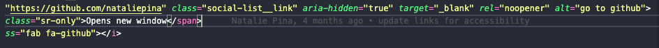

> I think git enters a whole other realm the moment you start working in teams -- there are so many cool different flows and ways that people can commit code, share code, and add code to your repo open-source or closed-source-wise. — [Scott Tolinski - Syntax.fm](https://podcasts.apple.com/us/podcast/git-fundamentals/id1253186678?i=1000492249335)

There is a stange in learning git where most developers don't know what a good commit message consists of. Eventually, you manage to come up with some sort of basic habits in your commit style. Have you ever wondered how you can improve those commit messages? Look no further! This guide outlines simple ways to improve your commits.

This article assumes you already understand basic git workflow. If not read some more about it it here: [Git Handbook](https://guides.github.com/introduction/git-handbook/) 

**Disclaimer:**  It is also important to note that you should follow your team's conventions first and foremost. These tips are based on suggestions based upon research and general consensus from the community.

## Why write better commit messages?

I challenge you to open up a personal project or any repository for that matter and run `git log`, to view a list of old commit messages. The vast majority of us who have run through tutorials or made quick fixes will say -- "Yep... I have absolutely no idea what I meant by "Fix style" 6 months ago."  

### Back To The Future
You are simply future-proofing yourself. You could save yourself and/or coworkers hours of troubleshooting by providing that description. The extra time to write a thoughtful commit message as a letter to your potential future self is extremely worthwhile. On large scale projects, documentation is imperative for maintenance. 

Collaboration and communication are SO important within engineering teams. The git commit message is a prime example of this. I highly suggest setting up a convention for commit messages on your team if you do not already have one in place.

### Methods to Commit

#### Basic:
`git commit -m <message>`

#### Detailed:
`git commit -m <title> -m <description>`

-----

## 5 Steps to Better Commit Messages
#### Let's summarize the important bits!

###### 1. Capitalization & Punctuation
Capitalize the first word and do not end in punctuation

###### 2. Mood
Use Imperative Mood in the subject line. 
Ex: `Add fix for dark mode toggle`

###### 3. Type of Commit 
Specify the type of commit. It is recommended and can be even more beneficial to have a consistent set of words to describe your changes. 
Ex: Bugfix, Update, Refactor, Bump, etc.

###### 4. Length
The first line should be no more than 50 characters, and 72 for the description.

###### 5. Content
Be direct, try to eliminate filler words/phrases in these sentences (ex: though, maybe, I think, kind of). Think like a journalist. Journalists and writers ask themselves questions to ensure their article is detailed, straightforward and answers all of the readers questions. They look to answer: _who_, _what_, _where_, _why_, _when_ and _how_. Some of these questions are clear such as _who_ is committing the code, _when_ changes were committed and _how_ through the code changes themselves. What we really need to focus on answering is _why_ and _what_.

For example, ask yourself:
- Why have I made these changes?
- What effect have my changes made?
- Why was the change needed?
- What are the changes in reference to?

-----

## Bonus Tips:

- Assume the reader does not understand what the commit is addressing. They may not have access to the ticket addressing the bug. 

- Don't expect the code to be self-explanatory. Similar to the point above. It might seem obvious to you the programmer if you're updating something like CSS styles since it is visual. However, for readers it really may not seem clear _why_ that change was made, if it's important to the functionality and so on.

See the difference below:
1. `git commit -m 'Add margin'`

2. `git commit -m 'Add margin to nav items to prevent them from overlapping the logo'`

It is clear which of these would be more useful to future readers. 

- Pretend you're writing an email or article. Give the headline that will sum up what happened and what is important. Provide further details in the body in an organized fashion. In filmmaking, it is often quoted "show, don't tell" using visuals as the communication medium compared to a verbal explanation of what is happening. In our case, "TELL, don't show" though we have some visuals at our disposal such as the browser, most of the details come from reading the physical code.

- Use a set of common prefixes for your commit messages. There are different implementation convetions out there for this. Examples: feat, fix, docs, style, refactor, test, chore. 
[Source](https://seesparkbox.com/foundry/semantic_commit_messages) 

- If you're using VSCode -- download GitBlame! This is a prime example of why useful commit messages can help future developers. This plugin will list the person who made the change, the date of the changes, as well as the commit message commented inline. Imagine how useful this could be in troubleshooting a bug or backtracing changes made.

-----

###Commit Example Comparison:

Review the following messages and see how many of the guidelines they check off in each category.

###### Good:

- `Bump version to 1.1.19`

- `Refactor function handling error messages to render a modal`

- `Fix onSubmit bug preventing users from submitting the subscribe form when clicking the submit button`

- `Update incorrect client phone number within footer body per clients request`

- `Optimize page speed performance with lazy load implementation for images`

###### Bad:

- `Fixed bug on landing page`

- `Changed style`

###### Worst:

- `Oops`

- `I think I fixed it?`

- ` 💩 ` 

-----

## Conclusion: TLDR;

Writing good commit messages is an extremely beneficial skill to develop, to aid in the communication and collaboration of teams. They serve as an archive of important changes. There is a general set of agreed-upon standards for commit messages, however, as long as your team agrees upon a convention that is descriptive with future readers in mind, there will be long-term benefits. How do you think these techniques can improve your commits?

Cover Photo Credit: [@YancyMin](https://unsplash.com/@yancymin)